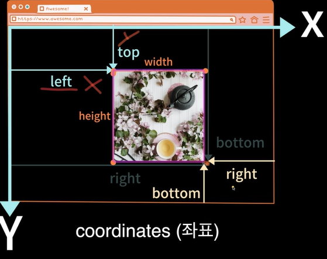

# DreamCoding 강의 학습 내용 정리

## 브라우저 구조 분석

- Window
  페이지 뿐만 아니라 브라우저에서 현재 열려있는 전체적인 창을 의미한다.

- Document
  페이지가 표기되는 부분.

- Navigator
  브라우저 자체에 관련된 정보들이 담겨 있는 부분.

- DOM (Document Object Model)
  새로운 요소를 추가 혹은 삭제하거나 움직인다.

- BOM (Browser Object Model)
  Web API에 관련된 오브젝트들이 들어 있다.

##

    1. window-size.html // 윈도우 사이즈 표기

    2. window-coordinates.html // 브라우저 좌표 & 윈도우 스크롤 API

    3. window-load.html // window load 순서

    4. coordinates // 마우스 좌표 표시

    5. rabbit // 윈도우 스크롤 응용 (당근과 토끼)

    6. dom code // 웹페이지 요소 분석

    7. shopping // to do list와 동일한 로직의 웹

    8. event // capturing & bubbling, 브라우저 기본 기능 취소(preventDefault), 이벤트 위임

    9. shopping // 이벤트 위임을 이용한 앱 개선

    10. carrot // 간단한 게임 만들기

## window-coordinates.html // 브라우저 좌표 & 윈도우 스크롤 API

- getBoundingClientRect
  Element 오브젝트 안에 들어있는 API, 즉 함수이다.
  요소의 사이즈나 위치에 관련된 다양한 정보를 얻을 수 있다.

- CSS에서는 absolute나 relative로 지정하게 되면 bottom과 right이 아래부터 시작이지만 getBoundingClient는 위에서부터 시작된다.

- Client x, y
  사용자가 보는 페이지에 상관 없이 브라우저에서 x, y 가 얼마나 떨어져 있는지 전달된다.

- Page x, y
  페이지 자체에서 떨어져 있는 x, y를 의미한다. (문서의 시작점부터)
